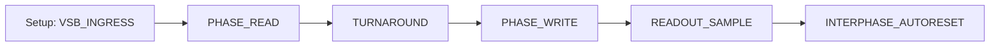

# DECIMA-8 🧠 — Neuromorphic Engine

**Deterministic rhythm for neuromorphic computing: Emulator → Proto (PCB) → FPGA → ASIC**

**Status:** v0.2 DESIGN FREEZE

**Codename:** Siberian Tank Interface

---

## 📖 About

**DECIMA-8** is a neuromorphic engine architecture with deterministic rhythm and programmable tile fabric.

### Key Principles v0.2

| Principle | Description |
|-----------|-------------|
| **Level16** | Data 0..15 on each of 8 lanes |
| **Bidirectional VSB** | Conductor sets input before READ, Island drives in WRITE |
| **Tile = minimal entity** | RuleROM addresses tiles directly |
| **BUS16 (8 lane)** | All data through common bus, neighbors don't transfer data |
| **Activation graph** | Neighbors form relay for BUS reading |
| **Range fuse** | LOCK if thr_cur16 ∈ [thr_lo16..thr_hi16] |
| **Decay-to-Zero** | Accumulator decays to 0, never jumps over |
| **Branch collapse** | Inactive tile resets to 0 |

---

## 🏗 Architecture

```
┌─────────────────────────────────────────────────────┐
│  Conductor (Digital Island)                         │
│  - CPU / Emulator                                   │
│  - Sets VSB_INGRESS                                 │
│  - Reads BUS16 after WRITE                          │
│  - Controls EV_FLASH / EV_RESET / EV_BAKE           │
└─────────────────────────────────────────────────────┘
                         │
                         │ VSB[0..7] + BUS16[0..7]
                         ▼
┌─────────────────────────────────────────────────────┐
│  Island / Swarm (Analog Core)                       │
│  ┌─────────────────────────────────────────────┐    │
│  │  Tile Array (16×16 = 256)                   │    │
│  │  ┌─────┬─────┬─────┐                        │    │
│  │  │ Tile│ Tile│ ... │                        │    │
│  │  ├─────┼─────┼─────┤  Each tile:            │    │
│  │  │ ... │ ... │ ... │  - 8 in/out lanes      │    │
│  │  └─────┴─────┴─────┘  - FUSE (thr/lock)     │    │
│  │         │                - Weights 8×8       │    │
│  └─────────┼───────────────────────────────────┘    │
│             │                                        │
│  ┌──────────▼──────────────────────────────────┐    │
│  │  BUS16 (common bus 8 lane)                  │    │
│  │  Honest summing of contributions            │    │
│  └─────────────────────────────────────────────┘    │
└─────────────────────────────────────────────────────┘
```

---

## 📚 Documentation

### Russian Version
- **Overview:** https://decima.rulerom.com/ru/
- **Architecture:** https://decima.rulerom.com/ru/arch/
- **Specification:** https://decima.rulerom.com/ru/spec/

### English Version
- **Overview:** https://decima.rulerom.com/en/
- **Architecture:** https://decima.rulerom.com/en/arch/
- **Specification:** https://decima.rulerom.com/en/spec/

### 中文版
- **概述：** https://decima.rulerom.com/zh/
- **架构：** https://decima.rulerom.com/zh/arch/
- **规范：** https://decima.rulerom.com/zh/spec/

### Sections

| Section | Description |
|---------|-------------|
| **[Tile Architecture](en/docs/arch/tiles.md)** | Tile model, FUSE-LOCK, ACTIVE closure |
| **[BUS16](en/docs/arch/bus.md)** | Honest summing, CLIP/OVF flags |
| **[READ/WRITE Phases](en/docs/arch/phase.md)** | Canonical tick EV_FLASH |
| **[Routing](en/docs/arch/routing.md)** | Activation graph, RoutingFlags16 |
| **[Bake TLV](en/docs/spec/bake.md)** | Binary baking format |
| **[Protocol](en/docs/spec/protocol.md)** | EV_FLASH, EV_RESET, UDP |
| **[IDE](en/docs/tools/ide.md)** | Visual baking environment |

---

## 🛠️ Quick Start

### Run Documentation

```bash
# Russian version
cd ru
mkdocs serve

# English version
cd en
mkdocs serve

# Chinese version
cd zh
mkdocs serve
```

### Project Structure

```
decima/
├── ru/                     # Russian documentation
│   ├── mkdocs.yml
│   └── docs/
│       ├── index.md
│       ├── arch/           # Architecture
│       ├── spec/           # Specification
│       ├── tools/          # Tools
│       └── integration/    # Integration
├── en/                     # English documentation
│   ├── mkdocs.yml
│   └── docs/
├── zh/                     # Chinese documentation
│   ├── mkdocs.yml
│   └── docs/
├── old/                    # Archive materials
├── README.md
├── llms.txt
└── ai-plugin.json
```

---

## 🔄 Canonical Tick (EV_FLASH)



| Phase | Description |
|-------|-------------|
| **PHASE_READ** | Tiles sample input, update runtime |
| **TURNAROUND** | Conductor: Hi-Z, Island: prepare drive |
| **PHASE_WRITE** | Island drives BUS16 |
| **READOUT_SAMPLE** | Conductor reads BUS16[0..7] |
| **AUTORESET** | Optional domain reset |

---

## 📊 Hard Constants v0.2

| Constant | Value |
|----------|-------|
| **VSB** | 8 data lanes VSB[0..7] |
| **BUS16** | 8 lane, summing in WRITE |
| **Domains** | 16 domains (0..15) |
| **Level16** | 0..15 (4 bits) |
| **RoutingFlags16** | 10 bits: N,E,S,W,NE,SE,SW,NW,BUS_R,BUS_W |

---

## 🔗 Ecosystem

| Project | Description | URL |
|---------|-------------|-----|
| **🌿 Intent-Garden** | Deterministic C/C++ verification engine | https://intent-garden.org |
| **📜 Rule-Rom** | Global library of intentions | https://rulerom.com |
| **🏛️ Swarm Council** | 16 elders in swarm core | https://intent-garden.org/swarm.html |
| **🧬 Personality Lab** | Neuromorphic personality bakery | https://intent-garden.org/bakery.html |

---

## 📧 Contact

- **Documentation:** https://decima.rulerom.com
- **Email:** vsb@decima8.org

---

**Bake the Future. Build the Substrate.** 🛠️⚡️
